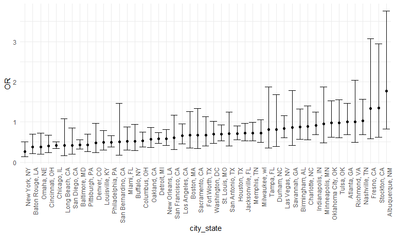
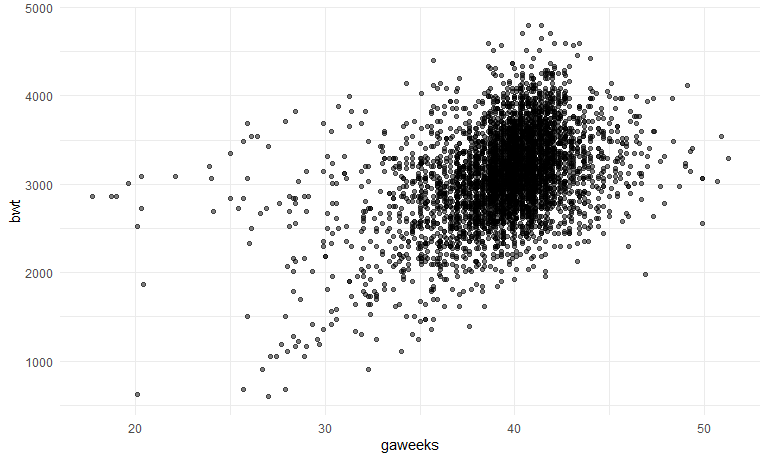
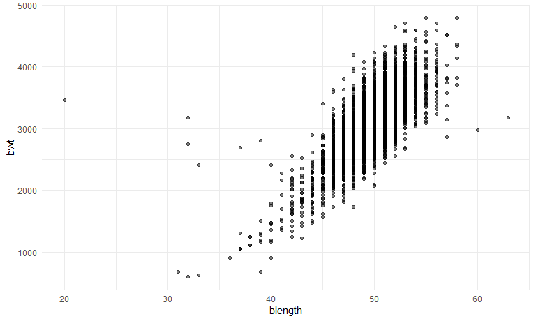
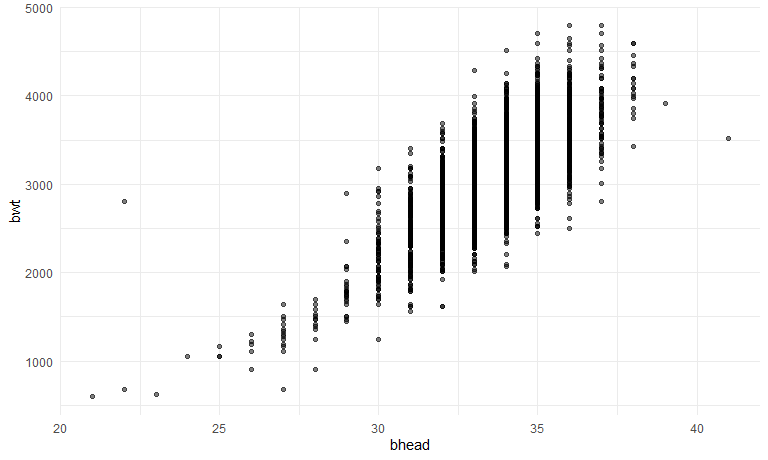
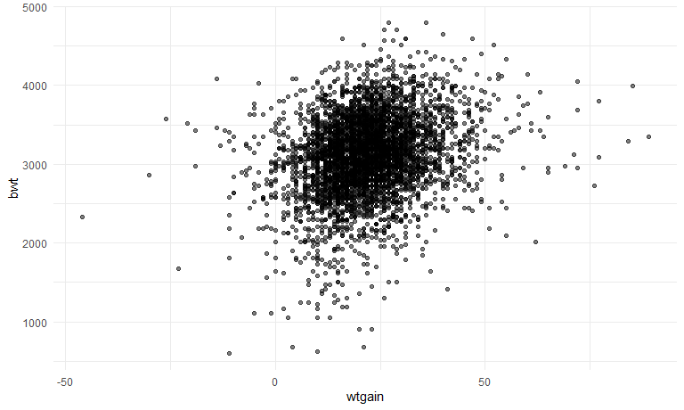
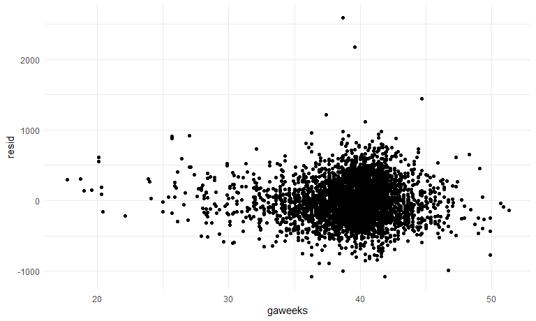
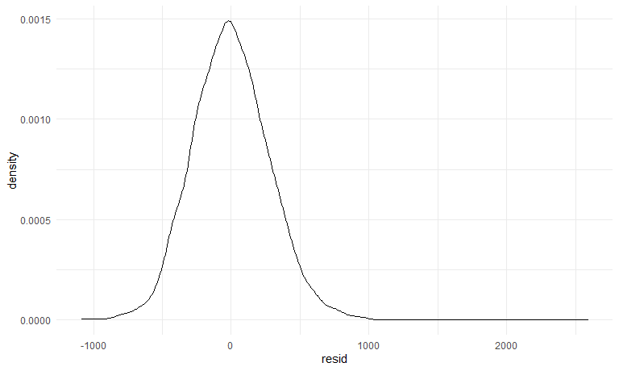
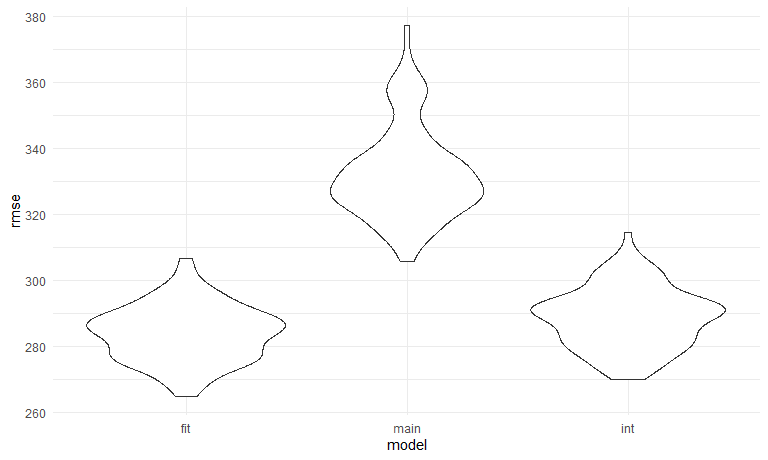
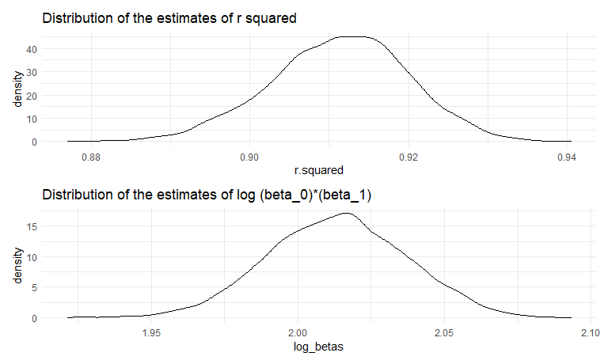

p8105\_hw6\_xl2834
================
Xiaoyu Li
11/25/2020

``` r
library(tidyverse)
library(modelr)
library(mgcv)
```

    ## Loading required package: nlme

    ## 
    ## Attaching package: 'nlme'

    ## The following object is masked from 'package:dplyr':
    ## 
    ##     collapse

    ## This is mgcv 1.8-33. For overview type 'help("mgcv-package")'.

``` r
library(p8105.datasets)
```

### Problem 1

``` r
homicide_df = 
  read_csv("data/homicide-data.csv", na = c("", "NA", "Unknown")) %>% 
  mutate(
    city_state = str_c(city, state, sep = ", "),
    victim_age = as.numeric(victim_age),
    resolution = case_when(
      disposition == "Closed without arrest" ~ 0,
      disposition == "Open/No arrest"        ~ 0,
      disposition == "Closed by arrest"      ~ 1)
  ) %>% 
  filter(
    victim_race %in% c("White", "Black"),
    city_state != "Tulsa, AL") %>% 
  select(city_state, resolution, victim_age, victim_race, victim_sex)
```

    ## Parsed with column specification:
    ## cols(
    ##   uid = col_character(),
    ##   reported_date = col_double(),
    ##   victim_last = col_character(),
    ##   victim_first = col_character(),
    ##   victim_race = col_character(),
    ##   victim_age = col_double(),
    ##   victim_sex = col_character(),
    ##   city = col_character(),
    ##   state = col_character(),
    ##   lat = col_double(),
    ##   lon = col_double(),
    ##   disposition = col_character()
    ## )

Start with one city.

``` r
baltimore_df =
  homicide_df %>% 
  filter(city_state == "Baltimore, MD")
glm(resolution ~ victim_age + victim_race + victim_sex, 
    data = baltimore_df,
    family = binomial()) %>% 
  broom::tidy() %>% 
  mutate(
    OR = exp(estimate),
    CI_lower = exp(estimate - 1.96 * std.error),
    CI_upper = exp(estimate + 1.96 * std.error)
  ) %>% 
  select(term, OR, starts_with("CI")) %>% 
  knitr::kable(digits = 3)
```

| term              |    OR | CI\_lower | CI\_upper |
| :---------------- | ----: | --------: | --------: |
| (Intercept)       | 1.363 |     0.975 |     1.907 |
| victim\_age       | 0.993 |     0.987 |     1.000 |
| victim\_raceWhite | 2.320 |     1.648 |     3.268 |
| victim\_sexMale   | 0.426 |     0.325 |     0.558 |

Try this across cities.

``` r
models_results_df = 
  homicide_df %>% 
  nest(data = -city_state) %>% 
  mutate(
    models = 
      map(.x = data, ~glm(resolution ~ victim_age + victim_race + victim_sex, data = .x, family = binomial())),
    results = map(models, broom::tidy)
  ) %>% 
  select(city_state, results) %>% 
  unnest(results) %>% 
  mutate(
    OR = exp(estimate),
    CI_lower = exp(estimate - 1.96 * std.error),
    CI_upper = exp(estimate + 1.96 * std.error)
  ) %>% 
  select(city_state, term, OR, starts_with("CI")) 
```

``` r
models_results_df %>% 
  filter(term == "victim_sexMale") %>% 
  mutate(city_state = fct_reorder(city_state, OR)) %>% 
  ggplot(aes(x = city_state, y = OR)) + 
  geom_point() + 
  geom_errorbar(aes(ymin = CI_lower, ymax = CI_upper)) + 
  theme(axis.text.x = element_text(angle = 90, hjust = 1))
```



## Problem 2

Import the dataset

``` r
baby_df = 
  read_csv("./data/birthweight.csv") %>% 
  select(bwt, babysex, bhead, blength, gaweeks, wtgain)
```

    ## Parsed with column specification:
    ## cols(
    ##   .default = col_double()
    ## )

    ## See spec(...) for full column specifications.

**Fit a model**

First, I checked the relationship between bwt and several candidate
predictors.

``` r
baby_df %>% 
  ggplot(aes(x = gaweeks, y = bwt)) +
  geom_point(alpha = 0.5)
```



``` r
baby_df %>% 
  ggplot(aes(x = blength, y = bwt)) +
  geom_point(alpha = 0.5)
```



``` r
baby_df %>% 
  ggplot(aes(x = bhead, y = bwt)) +
  geom_point(alpha = 0.5)
```



``` r
baby_df %>% 
  ggplot(aes(x = wtgain, y = bwt)) +
  geom_point(alpha = 0.5)
```



There seems to be a positive correlation between bwt and gaweeks, bhead,
and blength. I tried fitting a linear model with these predictors, and
then checked the residual against the main predictor of interest:
gaweeks, and the distribution of residuals.

``` r
model_fit = lm(bwt ~ gaweeks + blength + bhead + wtgain, data = baby_df)

baby_df %>% 
  modelr::add_residuals(model_fit) %>% 
  ggplot(aes(x = gaweeks, y = resid)) + 
  geom_point()
```



``` r
baby_df %>% 
  modelr::add_residuals(model_fit) %>% 
  ggplot(aes(x = resid)) + 
  geom_density()
```



The residuals seem to be evenly distributed over 0 across gaweeks,
Although there are 2 very large residuals at around gaweeks = 40. The
distribution of residual is approximately normal, although skewed to the
right. This is possibly due to the 2 large residuals observed at gaweeks
= 40.

**Build 2 other models.**

``` r
model_main = lm(bwt ~ gaweeks + blength, data = baby_df)
model_int = lm(bwt ~ bhead * blength * babysex, data = baby_df)
```

**Cross validation**

``` r
cv_df =
  crossv_mc(baby_df, 100) %>% 
  mutate(
    train = map(train, as_tibble),
    test = map(test, as_tibble))

cv_df = 
  cv_df %>% 
  mutate(
    model_fit = map(train, ~lm(bwt ~ gaweeks + blength + bhead + wtgain, data = .x)),
    model_main = map(train, ~lm(bwt ~ gaweeks + blength, data = .x)),
    model_int = map(train, ~lm(bwt ~ bhead * blength * babysex, data = .x))
  ) %>% 
  mutate(
    rmse_fit = map2_dbl(model_fit, test, ~rmse(model = .x, data = .y)),
    rmse_main = map2_dbl(model_main, test, ~rmse(model = .x, data = .y)),
    rmse_int = map2_dbl(model_int, test, ~rmse(model = .x, data = .y))
  )
```

**Compare models using cross-validated prediction error**

``` r
cv_df %>%
  select(starts_with("rmse")) %>% 
  pivot_longer(
    everything(),
    names_to = "model",
    values_to = "rmse",
    names_prefix = "rmse_") %>% 
  mutate(model = fct_inorder(model)) %>%
  ggplot(aes(x = model, y = rmse)) +
  geom_violin()
```



``` r
cv_df %>% 
  select(starts_with("rmse")) %>% 
  pivot_longer(
    everything(),
    names_to = "model",
    values_to = "rmse",
    names_prefix = "rmse_") %>%
  group_by(model) %>% 
  summarize(avg_rmse = mean(rmse))
```

    ## `summarise()` ungrouping output (override with `.groups` argument)

    ## # A tibble: 3 x 2
    ##   model avg_rmse
    ##   <chr>    <dbl>
    ## 1 fit       284.
    ## 2 int       289.
    ## 3 main      332.

The fit and interaction models have smaller prediction error than the
model with main effect. The fit model does a little bit better than
interaction model because it has lower mean rmse.

## Problem 3

``` r
weather_df = 
  rnoaa::meteo_pull_monitors(
    c("USW00094728"),
    var = c("PRCP", "TMIN", "TMAX"), 
    date_min = "2017-01-01",
    date_max = "2017-12-31") %>%
  mutate(
    name = recode(id, USW00094728 = "CentralPark_NY"),
    tmin = tmin / 10,
    tmax = tmax / 10) %>%
  select(name, id, everything())
```

    ## Registered S3 method overwritten by 'hoardr':
    ##   method           from
    ##   print.cache_info httr

    ## using cached file: C:\Users\Xiaoyu Li\AppData\Local\Cache/R/noaa_ghcnd/USW00094728.dly

    ## date created (size, mb): 2020-10-02 14:57:18 (7.535)

    ## file min/max dates: 1869-01-01 / 2020-09-30

Data preparation and making plots.

``` r
boot_df =
  weather_df %>%
  modelr::bootstrap(n = 5000) %>% 
  mutate(
    models = map(strap, ~lm(tmax ~ tmin, data = .x)),
    r_sq = map(models, broom::glance),
    results = map(models, broom::tidy)) %>% 
  select(-strap, -models) %>% 
  unnest(r_sq) %>% 
  select(.id, r.squared, results) %>% 
  unnest(results) %>%
  select(-std.error, -statistic, -p.value) %>% 
  pivot_wider(names_from = term, values_from = estimate) %>% 
  mutate(log_betas = log(`(Intercept)` * tmin))

plot_1 =
  boot_df %>% 
  ggplot(aes(x = r.squared)) + geom_density() +
  labs(title = "Distribution of the estimates of r squared")

plot_2 = 
  boot_df %>% 
  ggplot(aes(x = log_betas)) + geom_density() +
  labs(title = "Distribution of the estimates of log (beta_0)*(beta_1)")

plot_1 / plot_2
```


The distribution of r squared estimates is slightly left\_skewed, with a
mean at around 0.915. The distribution of log(β0∗β1) estimates is
approximately normal, and its mean is about 2.02.

Produce a 95% confidence interval for the estimates of r squared and
log(β0∗β1).

``` r
boot_df %>% 
  summarize(
    r_ci_u = quantile(r.squared, 0.025),
    r_ci_l = quantile(r.squared, 0.975),
    l_ci_u = quantile(log_betas, 0.025),
    l_ci_l = quantile(log_betas, 0.975)) %>% 
  knitr::kable()
```

|  r\_ci\_u |  r\_ci\_l | l\_ci\_u | l\_ci\_l |
| --------: | --------: | -------: | -------: |
| 0.8936977 | 0.9274807 | 1.966942 | 2.058528 |

The 95% CI for r squared is (0.89, 0.93). The 95% CI for log(β0∗β1) is
(1.97, 2.06).
